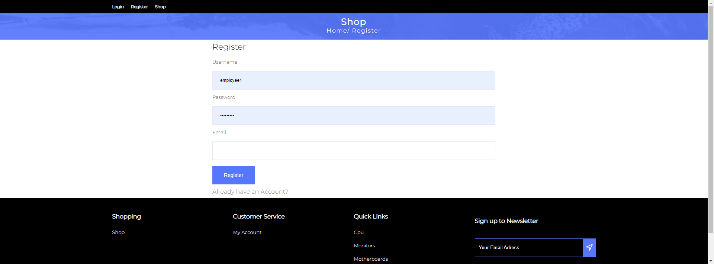

<b>Cyberstore</b> is an e-commerce website that allows users to buy computer hardware parts.

It provides a fully functional login/register system and implements the roles of admin and customer. 
  Once a <b>customer</b> is logged in, they have the following options at their disposal: 

  - Favourite Products
   
  - Add Products to Cart
   
  - Pay for a Product
   
  - View previous order details ( once payment is done)
   
  - Search for products and sort them by category/price
   
   

<b>Admin</b> has his own dashboard, where he can analyze the performance of the website with the help of charts, insert/edit new products and view all the products of the website.

<b>Technologies:<b/>
    Html | Css | Javascript | Laravel | Jquery | Sql

    
<h3>Homepage</h3>

<h3>Register</h3>

<h3>Cart</h3>

    
<h3>Checkout</h3>

    
<h3>Wishlist</h3>

    
<h3>Orders</h3>

<h3>Admin</h3>

